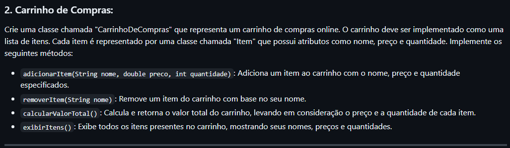

# Carrinho de Compras - Bootcamp Santander 2025

Este projeto foi desenvolvido como parte do módulo do Bootcamp Santander 2025 na plataforma DIO, com o objetivo de praticar e reforçar conceitos de Programação Orientada a Objetos em Java, além de trabalhar com Collections e Generics.

## Desafio Proposto

O desafio consistia em criar um sistema simples de carrinho de compras, permitindo ao usuário realizar operações como:

- Adicionar itens ao carrinho
- Listar itens presentes no carrinho
- Calcular o valor total dos itens
- Remover itens do carrinho

O sistema simula o funcionamento de um carrinho de compras, onde cada item possui nome, preço e quantidade, e todas as operações são realizadas de forma interativa via menu no console.

### Regras de Negócio

- O usuário pode adicionar quantos itens desejar, informando nome, preço e quantidade.
- É possível listar todos os itens do carrinho a qualquer momento.
- O valor total do carrinho é calculado somando o preço de cada item multiplicado pela sua quantidade.
- O usuário pode remover itens informando o nome do produto.
- O sistema impede operações inválidas, como remover itens inexistentes ou calcular o valor de um carrinho vazio.

## Minha Solução

Implementei o projeto utilizando três classes principais:

- **ItemCarrinho**: representa cada produto, com nome, preço e quantidade.
- **CarrinhoDeCompras**: gerencia a lista de itens, implementando as operações de adicionar, remover, listar e calcular o valor total.
- **App**: classe principal, responsável pelo menu interativo e pela integração das operações.

O menu permite ao usuário executar todas as operações do desafio, sempre respeitando as regras de negócio e informando mensagens claras sobre o estado do carrinho.

### Aprendizados

Apesar de já ter uma base sólida em Java, este projeto foi uma ótima oportunidade para reforçar conceitos de Collections, Generics e controle de fluxo, além de praticar a abstração e o encapsulamento. Sempre é bom revisar e aprimorar o conhecimento!

## Print do Desafio

> 

## Como Executar

1. Compile os arquivos Java presentes na pasta `src`:
   ```sh
   javac -d bin src/*.java
   ```
2. Execute o programa:
   ```sh
   java -cp bin App
   ```

## Considerações Finais

Este projeto reforçou a importância de trabalhar com listas, manipulação de dados e interação com o usuário em Java. Agradeço pela oportunidade de participar do Bootcamp Santander 2025 e de evoluir ainda mais na linguagem!
